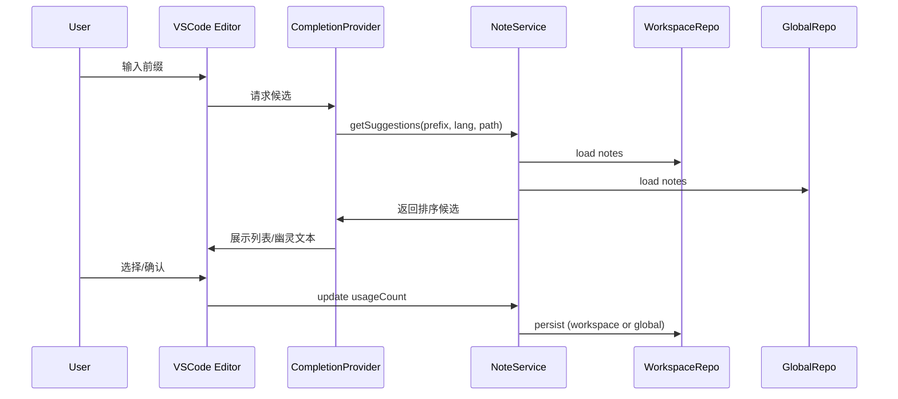

# 目标与范围
- 轻量“记事本 + 输入提示”插件，支持工作区与全局两类笔记源。
- 输入时提供候选与内联幽灵文本提示；侧边栏管理笔记；状态栏快速插入。

## UI交互线框图

### 1) 侧边栏 Notes 视图（TreeView）
```
+---------------------------------------------------+
| Notes                    [Search  🔎] [Tags ⌄]     |
|---------------------------------------------------|
| Workspace Notes                                   |
|  ├─ 🔖 Pinned: Build Commands                      |
|  ├─ TODO: Release Checklist                        |
|  └─ Draft: API Call Sample                         |
| Global Notes                                       |
|  ├─ Snippet: SQL Select                            |
|  ├─ Template: Meeting Minutes                      |
|  └─ Tip: Git Rebase                                |
|---------------------------------------------------|
| Actions: [+ New] [Import] [Export] [Settings]      |
+---------------------------------------------------+

右键菜单：Insert at Cursor / Edit / Pin/Unpin / Delete / Copy as Snippet
搜索与标签过滤位于顶部栏，支持实时过滤与排序（Pinned→前置，Recent→靠前）。
```

### 2) 笔记详情编辑（WebviewView 或内置编辑框）
```
+-----------------------------------------------+
| Title: [             ]       [Pinned ☐]       |
| Tags: [ +tag ]  Scope: [Languages ⌄][Paths ⌄]|
|-----------------------------------------------|
| Content (Monospace Markdown/Snippet 支持)      |
|  -------------------------------------------  |
|  | 例如：                                      |
|  | ```ts                                       |
|  | fetch('${1:url}')                           |
|  | // ${2:cursor}                              |
|  | ```                                         |
|  -------------------------------------------  |
|-----------------------------------------------|
| [Save] [Insert at Cursor] [Preview Snippet]   |
+-----------------------------------------------+
```
- 默认将当前编辑器选区作为初始内容；支持 Snippet 占位符预览与插入。

### 3) 快速插入（QuickPick）
```
+--------------------------------+
| Insert Note (type to search)   |
|--------------------------------|
| ▸ Build Commands (pinned)      |
| ▸ SQL Select                   |
| ▸ Meeting Minutes              |
| ▸ API Call Sample              |
|--------------------------------|
| [↑/↓ 选择] [Enter 插入]        |
+--------------------------------+
```
- 通过命令或状态栏入口打开；按评分展示 Top-N 候选。

### 4) 状态栏入口
```
[📝 Notes: 3]  ▸  最近使用 ▸  新建 ▸  打开侧边栏
```
- 点击弹出 QuickPick；显示最近使用计数与快捷操作。

### 5) 设置页（VSCode Settings）
```
Extension: Notepad
  ✓ Enable Inline Suggestions       (默认: 开)
  Max Suggestions                   (默认: 5)
  Trigger Characters                (默认: [" ", ".", "/", "-", "_"])
  Suggest In Languages              (默认: 全部)
  Excluded Paths                    (默认: 空)
  Prefer Workspace File             (默认: 开)
```

## 页面讲解（视图说明）
- Notes 侧边栏：主入口，承载搜索/过滤/树形展示；提供 CRUD 与右键上下文操作；Actions 区用于导入导出与打开设置。
- 笔记详情编辑：用于新建与编辑，包含标题/标签/作用域/内容与 Snippet 预览与插入；内容支持 Markdown 与 VSCode Snippet 语法。
- 快速插入：面向高频“插入到光标处”场景，兼顾键盘流；评分排序与最近使用增强效率。
- 状态栏：一键打开 QuickPick 与显示活跃度；减少鼠标移动。
- 设置页：行为调优与作用域控制；团队共享时可偏好 `.vscode/notepad.json`。

## 功能与数据
- 数据结构：`Note{id, title, content, tags[], scope{languages[], paths[]}, snippet?, triggers[], createdAt, updatedAt, usageCount, pinned?}`；文件：`{version, notes[]}`。
- 存储：工作区 `.vscode/notepad.json` 或 `context.storageUri`；全局 `context.globalStorageUri/notepad.json`；存在工作区文件时优先共享。
- 提示：Completion + Inline，基于前缀/语言/路径/usageCount/pinned 排名；Snippet 语法插入。

## 交互流程（Mermaid）


## 架构与模块
- NoteRepository（Workspace/Global）
- NoteService（合并/搜索/评分/最近使用）
- CompletionProvider / InlineProvider
- NotesTreeProvider（TreeView 与右键菜单）
- Commands（集中注册）
- Settings（配置与监听）

## 测试与验收
- 单元测试：评分与合并、作用域过滤、仓库读写、设置影响。
- 集成测试：新建/编辑/删除/插入、侧边栏/QuickPick/状态栏交互、导入导出。
- 验收：安装即用；空工作区/大型仓库稳定；无未捕获异常；数据持久正确。

## 交付目录
- `package.json`、`src/extension.ts`、`src/notes/*`、`src/ui/notesTree.ts`、`test/*`、`docs/VSCode-Notepad/*`（确认后生成）。

## 待确认
- 初版笔记编辑采用 TreeView + VSCode 原生输入控件，或直接使用 WebviewView？
- 是否默认优先 `.vscode/notepad.json` 以便团队共享？
- Inline 幽灵文本默认开启并在所有语言启用？

确认后我将搭建工程骨架并实现核心功能与上述 UI。