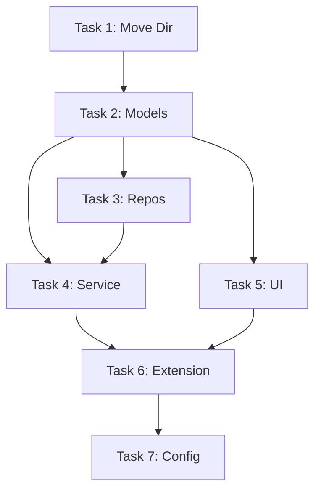

# 任务分解（TASK）- 金良提示语重构

## 1. 任务列表

### Task 1: 模块重命名与移动
*   **输入**: 现有的 `src/notes` 目录。
*   **动作**: 将 `src/notes` 重命名为 `src/prompts`。
*   **输出**: `src/prompts` 目录存在。

### Task 2: 重构数据模型 (Model Layer)
*   **输入**: `src/prompts/models.ts`。
*   **动作**:
    *   Interface `Note` -> `Prompt`。
    *   Interface `NoteFile` -> `PromptFile` (若还需要)。
    *   删除不必要的字段 (如 `snippet`, `triggers` 若不再使用)。
*   **输出**: 更新后的 `models.ts`。

### Task 3: 重构数据仓库 (Repository Layer)
*   **输入**: `src/prompts/repositories.ts`。
*   **动作**:
    *   Class `WorkspaceFileNotesRepository` -> `WorkspacePromptRepository`.
    *   存储路径: `jinliang-notes` -> `jinliang-prompts`.
    *   更新所有对 `Note` 类型的引用为 `Prompt`.
*   **输出**: 更新后的 `repositories.ts`。

### Task 4: 重构业务服务 (Service Layer)
*   **输入**: `src/prompts/service.ts`。
*   **动作**:
    *   Class `NoteService` -> `PromptService`.
    *   更新方法签名 `createNote` -> `createPrompt` 等。
    *   确保 `processTemplate` 逻辑保留并适配新类型。
*   **输出**: 更新后的 `service.ts`.

### Task 5: 重构 UI 组件
*   **输入**: `src/ui/notesTree.ts`.
*   **动作**:
    *   重命名文件为 `src/ui/promptsTree.ts`.
    *   Class `NotesProvider` -> `PromptsProvider`.
    *   更新 TreeItem 显示逻辑 (图标、描述)。
*   **输出**: 更新后的 `promptsTree.ts`.

### Task 6: 集成与入口更新
*   **输入**: `src/extension.ts`.
*   **动作**:
    *   更新 Import 路径 (`src/notes/...` -> `src/prompts/...`).
    *   实例化 `PromptService` 而非 `NoteService`.
    *   确保所有 command handler 使用新的 Service 方法。
*   **输出**: 可编译运行的 `extension.ts`.

### Task 7: 配置清理
*   **输入**: `package.json`.
*   **动作**:
    *   检查 `configuration` 节点，将 `notepad.*` 配置项重命名为 `prompts.*` (如 `prompts.workspaceFilePreferred`).
*   **输出**: 更新后的 `package.json`.

## 2. 依赖关系图

